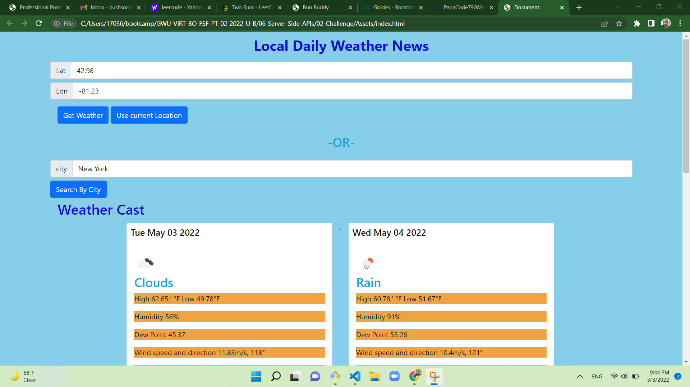

## Instruction

- I created working directory to have all my files in it that I will use: HTML, CSS, JS and ReadME

## Functionality 

- WHEN I search search current location, I am presented with option to get weather by lat or lon or by city name.
- When I click, I am presented with 5 days weather conditions: current and future  conditions for that city with the curent date forecast.
- WHEN I view current weather conditions for that city, you are presented with High, Low, Humidity, Dew Point Wind speed and direction of that location
- THEN I am presented with the city name, the date, an icon representation of weather conditions, the temperature, the humidity, the wind speed, and the UV index
- WHEN I view the UV index
- THEN I am presented with a color that indicates whether the conditions are favorable, moderate, or severe
- WHEN I view future weather conditions for that city
- THEN I am presented with a 5-day forecast that displays the date, an icon representation of weather conditions, the temperature, the wind speed, and the humidity.

- Added comments for information and also to make search easier for use

## User Story

- AS I decided to travel to this city or location, I would like to know the weather condition I am presented to be better prepare.
- I want to know the types of clothing I need to take with me.
- SO plan for the activities I could do while there based on the temperature or weather condition.

## application

* Created javaScripts for functionality 
* eventListener 
* Moment.js
* API Documentation

* The URL of the deployed application.

* The URL of the GitHub repository. 

## Screenshot

## Contributors

- Badara Dia <pushsoccer79@gmail.com>

---

## License & copydright

©Badara Dia